# TechCup Backend

## integrantes

* DanieL Ahumada
* Roger Duran
* Camilo Torres
* Camilo León
* Juan Neira

---

Preguntas sobre la estructura de paquetes en Spring Boot

1. Controller:
	- El paquete **Controller** contiene las clases que exponen la API (endpoints REST). Su responsabilidad es recibir las solicitudes HTTP, validar parámetros básicos y delegar la lógica al `Service`.

2. Service:
	- El paquete **Service** incluye la lógica de negocio de la aplicación. Aquí se implementan las reglas, orquestación entre repositorios y otras operaciones que no pertenecen a la capa de persistencia ni a la presentación.

3. Repository:
	- El paquete **Repository** gestiona el acceso a datos (persistencia). Normalmente contiene interfaces que extienden `JpaRepository` o similares para realizar consultas a la base de datos.

4. Controller (repetido):
	- Igual que la respuesta 1: controla las rutas/recursos expuestos y delega en `Service` para el procesamiento.

5. Entity:
	- El paquete **Entity** define las clases que representan las tablas (o documentos) de la base de datos. Incluye anotaciones JPA (`@Entity`, `@Id`, etc.) y mapeo de campos.

6. DTO:
	- El paquete **DTO** (Data Transfer Objects) contiene estructuras usadas para transferir datos entre capas o hacia/desde el cliente. Sirven para encapsular solo los campos necesarios y evitar exponer entidades directamente.

7. Exception:
	- El paquete **Exception** centraliza las clases de excepción y manejadores (custom exceptions y `@ControllerAdvice`). Facilita el manejo consistente de errores y la limpieza del código de negocio.

Si quieres, puedo ajustar la redacción o traducirlo a otro formato (FAQ, tabla, etc.).

Plataforma digital para la gestion del torneo semestral de futbol.

## Objetivo de este ejercicio

Este laboratorio consolida la capa API del primer ciclo sin modificar la logica de negocio existente en el dominio. Los cambios se enfocan en exponer endpoints REST y organizar responsabilidades siguiendo principios de Clean Code y SOLID (controladores delgados, servicios con reglas de negocio, repositorio separado para persistencia).

## Cambios implementados

### Controllers agregados/actualizados

- `UserController`: endpoint existente para listar usuarios.
- `TeamController`: gestion basica de equipos en memoria para el ciclo 1.
- `TournamentController`: creacion y gestion de torneos sobre la lista administrada por servicio.
- `MatchController`: registro de eventos de partido (gol, falta, tarjetas, alineacion).
- `GlobalExceptionHandler`: mapeo centralizado de excepciones a HTTP 400.

### Services actualizados

Se mantuvo la logica original de negocio y se registraron como beans de Spring con `@Service` para inyeccion por constructor en controladores:

- `TeamService`
- `TournamentService`
- `MatchService`
- `UserService` (ya existente)

### Repositories

- `UserRepository` permanece como repositorio JPA (`JpaRepository<UserEntity, Long>`) para usuarios.

## Endpoints disponibles (ciclo 1)

### Users

- `GET /users`

### Teams

- `GET /teams`
- `POST /teams`
- `POST /teams/{teamId}/players`
- `POST /teams/{teamId}/captain`

### Tournaments

- `GET /tournaments`
- `POST /tournaments`
- `POST /tournaments/{tournamentIndex}/teams`
- `POST /tournaments/{tournamentIndex}/matches`
- `POST /tournaments/{tournamentIndex}/referee`

### Matches

- `POST /matches/goal`
- `POST /matches/fault`
- `POST /matches/yellow-card`
- `POST /matches/red-card`
- `POST /matches/lineup`

## Pruebas agregadas para la API

Se agregaron pruebas orientadas a endpoints con `MockMvc`:

- `TeamControllerTest`
- `TournamentControllerTest`
- `MatchControllerApiTest`

## Ejecucion del proyecto

### Compilar

```bash
mvn -q -DskipTests compile
```

### Ejecutar aplicacion

```bash
mvn spring-boot:run
```

### Ejecutar pruebas del API (controladores)

```bash
mvn -q -Djacoco.skip=true test -Dtest=TeamControllerTest,TournamentControllerTest,MatchControllerApiTest
```

Nota: en entornos con Java 25, JaCoCo puede presentar incompatibilidad de instrumentacion. Por eso se usa `-Djacoco.skip=true` para validar pruebas de endpoints en este contexto.

## Evidencias de calidad

### SonarQube
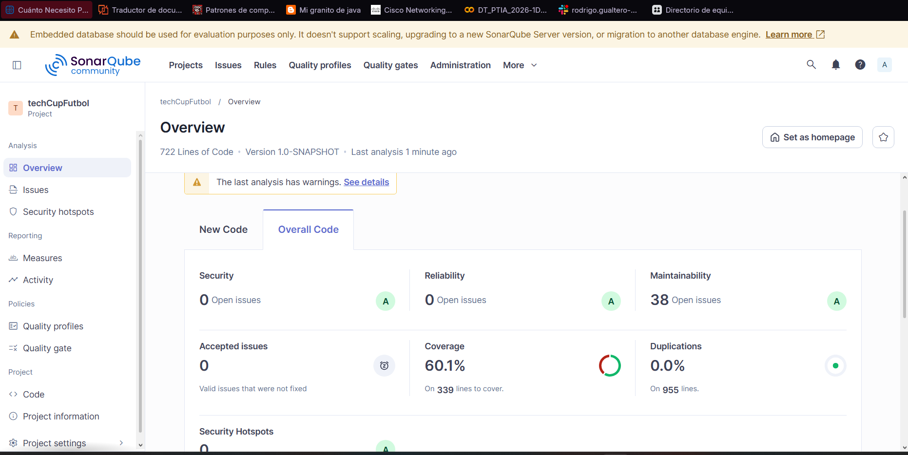

### JaCoCo
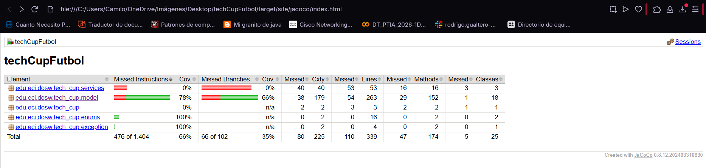

## Parte 4 - Swagger (Documentar API)

Se implemento documentacion automatica de API con Swagger/OpenAPI usando `springdoc-openapi`.

### Cambios realizados

- Dependencia agregada en `pom.xml`:
	- `org.springdoc:springdoc-openapi-starter-webmvc-ui:2.3.0`
- Configuracion OpenAPI agregada en:
	- `src/main/java/edu/eci/dosw/tech_cup/config/OpenApiConfig.java`
- Rutas de Swagger configuradas en:
	- `src/main/resources/application.properties`
	- `springdoc.api-docs.path=/api-docs`
	- `springdoc.swagger-ui.path=/swagger-ui.html`
- Anotaciones de documentacion agregadas a controladores:
	- `UserController`
	- `TeamController`
	- `TournamentController`
	- `MatchController`

### Como ejecutar y probar Swagger

1. Compila el proyecto:

```bash
mvn -q -DskipTests compile
```

2. Levanta la aplicacion:

```bash
mvn spring-boot:run
```

3. Abre Swagger UI en el navegador:

- `http://localhost:8080/api/swagger-ui.html`

4. Si quieres ver el JSON OpenAPI:

- `http://localhost:8080/api/api-docs`

### Verificacion realizada

- Swagger UI responde con HTTP `302` (redireccion valida hacia la interfaz).
- OpenAPI docs responde con HTTP `200`.

## Parte 5 - Logger (Trazabilidad de API)

Se implemento un logger transversal para registrar la ejecucion de endpoints sin modificar la logica de negocio.

### Cambios realizados

- Dependencia AOP agregada en `pom.xml`:
	- `org.springframework.boot:spring-boot-starter-aop`
- Aspecto de logging creado en:
	- `src/main/java/edu/eci/dosw/tech_cup/config/ApiLoggingAspect.java`
	- Registra entrada y salida de operaciones REST con:
		- Metodo HTTP
		- URI
		- Operacion ejecutada
		- Duracion en ms
	- Registra errores con stacktrace cuando una operacion falla
- Manejo de excepciones reforzado en:
	- `src/main/java/edu/eci/dosw/tech_cup/controller/GlobalExceptionHandler.java`
	- Se deja traza `WARN` al responder errores 400
- Configuracion de salida de logs en:
	- `src/main/resources/application.properties`
	- `logging.file.name=logs/techcup.log`
	- Patrones personalizados para consola y archivo

### Como ejecutar y verificar el logger

1. Compila el proyecto:

```bash
mvn -q -DskipTests compile
```

2. Ejecuta la aplicacion:

```bash
mvn spring-boot:run
```

3. Consume cualquier endpoint, por ejemplo:

```bash
curl -X GET http://localhost:8080/api/users
```

4. Revisa los logs:

- Consola de Spring Boot
- Archivo `logs/techcup.log`

Veras trazas tipo `API IN`, `API OUT` y `API ERROR` para cada solicitud.

## Laboratorio 8 - Paso 4 (Seleccion de entidades para base de datos)

En este laboratorio iniciamos el trabajo orientado a persistencia y manejo de base de datos. Para el paso 4 se solicita definir al menos 3 entidades con las que se realizara la practica inicial de modelado y operaciones de datos.

### Entidades seleccionadas

- **Usuario**
- **Team**
- **Matches**

### Justificacion de la seleccion

Estas tres entidades representan el nucleo funcional del sistema y permiten practicar los conceptos principales de persistencia:

- La entidad **Usuario** permite trabajar datos de identidad, roles y administracion de informacion personal.
- La entidad **Team** permite modelar la estructura de equipos y sus relaciones con jugadores.
- La entidad **Matches** permite registrar eventos del torneo y relacionar equipos, resultados y estadisticas.

Con esta base se busca comprender de forma progresiva la gestion de base de datos dentro del proyecto antes de extender el modelo a mas entidades.

### Alcance de esta fase

En esta etapa **no se implementan cambios de codigo**. El objetivo es dejar documentada la planeacion de entidades que se usaran para las siguientes actividades del laboratorio.

## Entrega final - Persistencia (Laboratorio)

Esta seccion resume los requisitos de entrega solicitados y la evidencia asociada dentro del proyecto.

### Checklist de cumplimiento

- [x] Minimo 3 entidades JPA.
- [x] Minimo 3 repositorios.
- [x] Minimo 1 relacion entre entidades.
- [x] Conexion funcional a PostgreSQL (configurada en el proyecto).
- [x] Pruebas con H2.
- [x] Integracion de persistencia con controladores y servicios.

### Entidades JPA implementadas

- `UserEntity`
- `TeamEntity`
- `MatchEntity`
- `TournamentEntity`

Ubicacion: [src/main/java/edu/eci/dosw/tech_cup/entities](src/main/java/edu/eci/dosw/tech_cup/entities)

### Repositorios implementados

- `UserRepository`
- `TeamRepository`
- `MatchRepository`
- `TournamentRepository`

Ubicacion: [src/main/java/edu/eci/dosw/tech_cup/repositories](src/main/java/edu/eci/dosw/tech_cup/repositories)

### Relacion entre entidades (JPA)

Se implemento la relacion `TournamentEntity` 1:N `MatchEntity`:

- `TournamentEntity` contiene `@OneToMany(mappedBy = "tournament")`.
- `MatchEntity` contiene `@ManyToOne` con `@JoinColumn(name = "tournament_id")`.

Referencias:

- [src/main/java/edu/eci/dosw/tech_cup/entities/TournamentEntity.java](src/main/java/edu/eci/dosw/tech_cup/entities/TournamentEntity.java)
- [src/main/java/edu/eci/dosw/tech_cup/entities/MatchEntity.java](src/main/java/edu/eci/dosw/tech_cup/entities/MatchEntity.java)

### Conexion a PostgreSQL

La aplicacion esta configurada para PostgreSQL en:

- [src/main/resources/application.properties](src/main/resources/application.properties)

Parametros clave:

- `spring.datasource.url=jdbc:postgresql://localhost:5432/TechCup`
- `spring.datasource.driver-class-name=org.postgresql.Driver`
- `spring.jpa.database-platform=org.hibernate.dialect.PostgreSQLDialect`

### Pruebas con H2

La configuracion de pruebas usa H2 con perfil `test`:

- [src/test/resources/application-test.properties](src/test/resources/application-test.properties)
- [src/test/java/edu/eci/dosw/tech_cup/RepositoryJpaTest.java](src/test/java/edu/eci/dosw/tech_cup/RepositoryJpaTest.java)
- [src/test/java/edu/eci/dosw/tech_cup/TeamControllerTest.java](src/test/java/edu/eci/dosw/tech_cup/TeamControllerTest.java)
- [src/test/java/edu/eci/dosw/tech_cup/TournamentControllerTest.java](src/test/java/edu/eci/dosw/tech_cup/TournamentControllerTest.java)
- [src/test/java/edu/eci/dosw/tech_cup/MatchControllerApiTest.java](src/test/java/edu/eci/dosw/tech_cup/MatchControllerApiTest.java)

Resultado de ejecucion de pruebas en entorno de desarrollo:

- `156 passed, 0 failed`.

### Integracion de persistencia con servicios y controladores

La persistencia esta integrada en la capa de servicios y expuesta por controladores REST.

Servicios:

- `UserService`
- `TeamService`
- `MatchService`
- `TournamentService`

Controladores:

- `UserController`
- `TeamController`
- `MatchController`
- `TournamentController`

### Enlaces de entrega

- Enlace del repositorio principal: https://github.com/A1Daniel1/techCupFutbol
- Enlace del repositorio del microservicio: PENDIENTE (agregar URL del microservicio).

### Evidencias solicitadas en README

- Evidencia de tablas creadas en PostgreSQL:

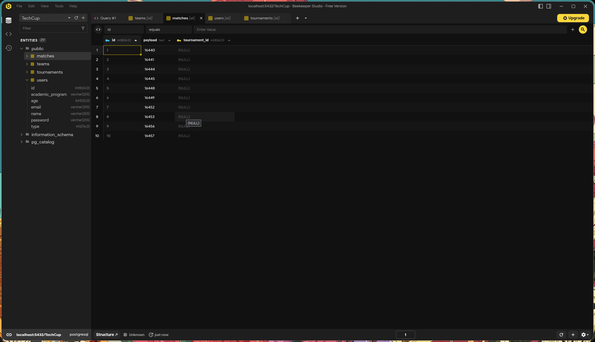
- Evidencia de pruebas ejecutadas con H2:

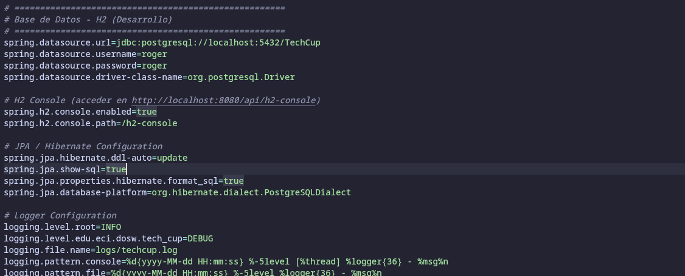
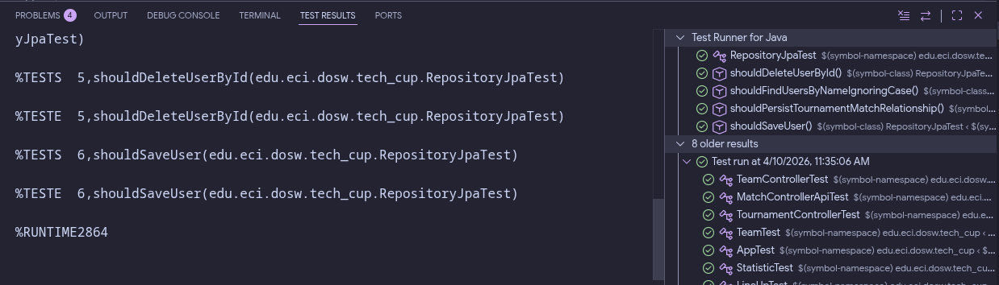

### Evidencia de URLs locales de la API

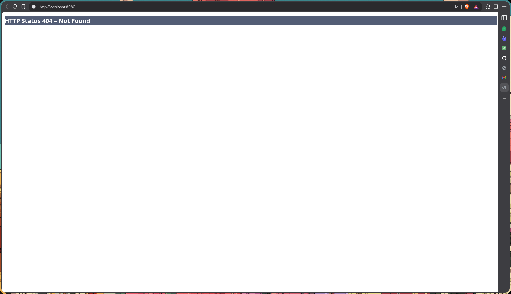
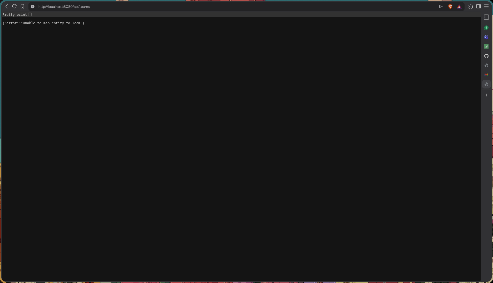

---
# Parte B - microServicio de imagenes

Este microservicio es un proyecto independiente encargado de la gestión de imágenes del sistema (jugadores, torneos, etc.) utilizando una base de datos NoSQL


**link del microservicio:** https://github.com/A1Daniel1/techCupMicroService


---

## Estructura del microservicio

Se implementó siguiendo una arquitectura de capas:


* **Documento (ImagenDocument):** Define la estructura de los datos en MongoDB, incluyendo nombre, tipo de contenido, datos binarios (byte[]), fecha de carga y una referencia externa.


* **Repositorio (ImagenRepository):** Interfaz que extiende MongoRepository para operaciones CRUD y búsquedas por referencia externa.


* **Servicio (ImagenService):** Contiene la lógica para procesar archivos MultipartFile y convertirlos en documentos persistibles.


* **Controlador (ImagenController):** Expone los endpoints REST para la gestión de archivos.

---

## Configuración de Persistencia (MongoDB)

La conexión se configuró en el archivo application.properties apuntando a una instancia de MongoDB que tenemos en docker:

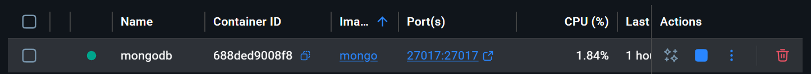


El aplication properties lo tenemos de la siguiente manera:

```
spring.data.mongodb.uri=mongodb://localhost:27017/lab8images
server.port=8081
```
---

### Pruebas de Funcionamiento (Evidencias)

Para validar el microservicio, se realizaron las siguientes pruebas utilizando Postman

### Subir una imagen:

+ Endpoint: ``POST /imagenes``
+ Body: ``form-data`` con los campos ``archivo`` (File) y ``referenciaExterna`` (String).
+ Resultado esperado: Recibir un objeto JSON con el ``id`` generado por MongoDB y los metadatos de la imagen.

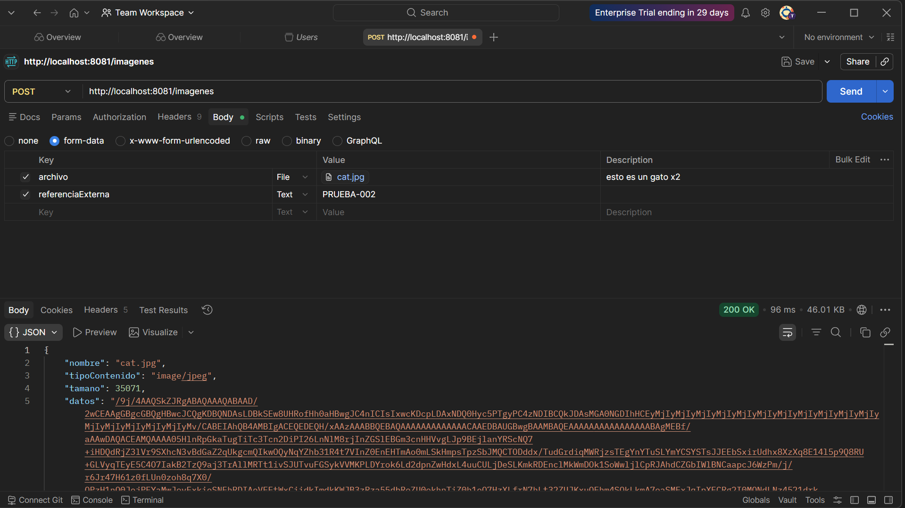

### Listar imágenes:


+ Endpoint: ``GET /imagenes``

+ Resultado esperado: Un arreglo JSON con todos los documentos de imágenes almacenados.

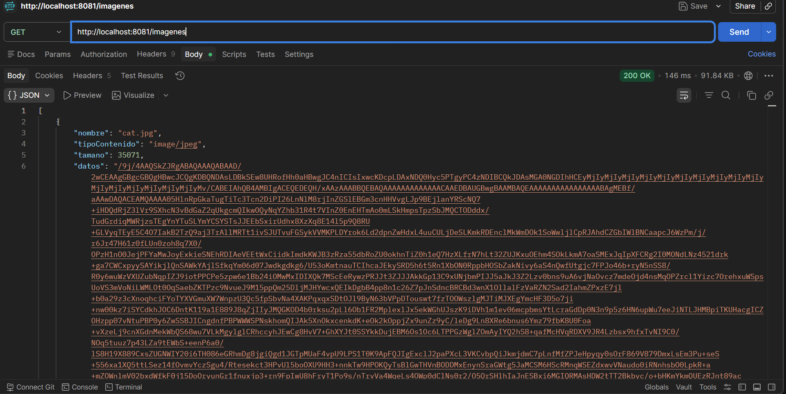


### Consultar imagen por ID:


+ Endpoint: GET /imagenes/{id}

+ Resultado esperado: Retorno de los datos binarios de la imagen con el tipo de contenido correcto (ej. image/png).

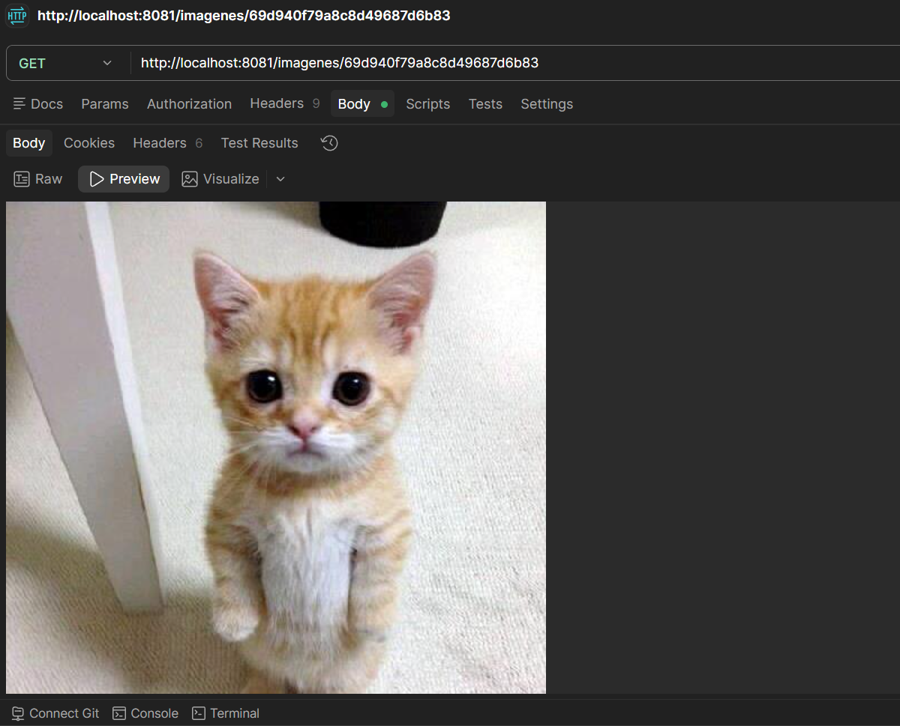


### Listar por referencia externa:


+ Endpoint: GET /imagenes/referencia/{referenciaExterna}

+ Uso: Útil para obtener todas las imágenes asociadas a un torneo o equipo específico.

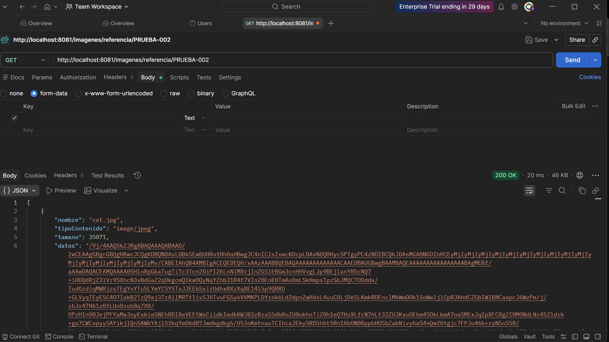


### Eliminar una imagen:


+ Endpoint: DELETE /imagenes/{id}

+ Resultado esperado: Confirmación de la eliminación del registro en MongoDB.

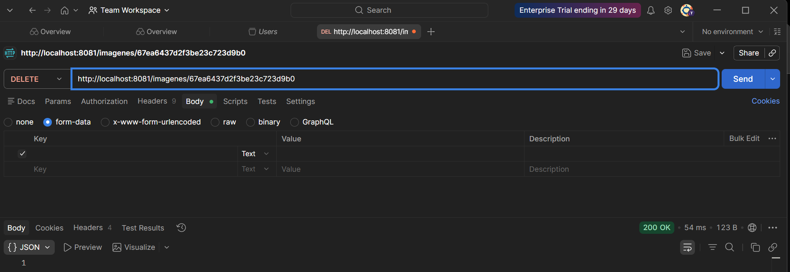
