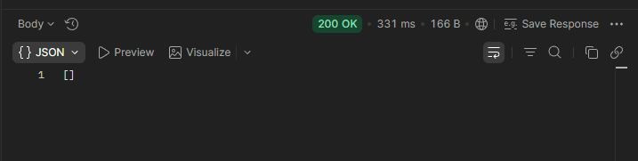

# techCupFutbol

Plataforma digital para la gestion del torneo semestral de futbol.

## Objetivo de este ejercicio

Este laboratorio consolida la capa API del primer ciclo sin modificar la logica de negocio existente en el dominio. Los cambios se enfocan en exponer endpoints REST y organizar responsabilidades siguiendo principios de Clean Code y SOLID (controladores delgados, servicios con reglas de negocio, repositorio separado para persistencia).

## Cambios implementados

### Controllers agregados/actualizados

- `UserController`: endpoint existente para listar usuarios.
- `TeamController`: gestion basica de equipos en memoria para el ciclo 1.
- `TournamentController`: creacion y gestion de torneos sobre la lista administrada por servicio.
- `MatchController`: registro de eventos de partido (gol, falta, tarjetas, alineacion).
- `GlobalExceptionHandler`: mapeo centralizado de excepciones a HTTP 400.

### Services actualizados

Se mantuvo la logica original de negocio y se registraron como beans de Spring con `@Service` para inyeccion por constructor en controladores:

- `TeamService`
- `TournamentService`
- `MatchService`
- `UserService` (ya existente)

### Repositories

- `UserRepository` permanece como repositorio JPA (`JpaRepository<UserEntity, Long>`) para usuarios.

## Endpoints disponibles (ciclo 1)

### Users

- `GET /users`

### Teams

- `GET /teams`
- `POST /teams`
- `POST /teams/{teamId}/players`
- `POST /teams/{teamId}/captain`

### Tournaments

- `GET /tournaments`
- `POST /tournaments`
- `POST /tournaments/{tournamentIndex}/teams`
- `POST /tournaments/{tournamentIndex}/matches`
- `POST /tournaments/{tournamentIndex}/referee`

### Matches

- `POST /matches/goal`
- `POST /matches/fault`
- `POST /matches/yellow-card`
- `POST /matches/red-card`
- `POST /matches/lineup`

## Pruebas agregadas para la API

Se agregaron pruebas orientadas a endpoints con `MockMvc`:

- `TeamControllerTest`
- `TournamentControllerTest`
- `MatchControllerApiTest`

## Ejecucion del proyecto

### Compilar

```bash
mvn -q -DskipTests compile
```

### Ejecutar aplicacion

```bash
mvn spring-boot:run
```

### Ejecutar pruebas del API (controladores)

```bash
mvn -q -Djacoco.skip=true test -Dtest=TeamControllerTest,TournamentControllerTest,MatchControllerApiTest
```

Nota: en entornos con Java 25, JaCoCo puede presentar incompatibilidad de instrumentacion. Por eso se usa `-Djacoco.skip=true` para validar pruebas de endpoints en este contexto.

## Evidencias de calidad

### SonarQube


### JaCoCo


## Parte 4 - Swagger (Documentar API)

Se implemento documentacion automatica de API con Swagger/OpenAPI usando `springdoc-openapi`.

### Cambios realizados

- Dependencia agregada en `pom.xml`:
	- `org.springdoc:springdoc-openapi-starter-webmvc-ui:2.3.0`
- Configuracion OpenAPI agregada en:
	- `src/main/java/edu/eci/dosw/tech_cup/config/OpenApiConfig.java`
- Rutas de Swagger configuradas en:
	- `src/main/resources/application.properties`
	- `springdoc.api-docs.path=/api-docs`
	- `springdoc.swagger-ui.path=/swagger-ui.html`
- Anotaciones de documentacion agregadas a controladores:
	- `UserController`
	- `TeamController`
	- `TournamentController`
	- `MatchController`

### Como ejecutar y probar Swagger

1. Compila el proyecto:

```bash
mvn -q -DskipTests compile
```

2. Levanta la aplicacion:

```bash
mvn spring-boot:run
```

3. Abre Swagger UI en el navegador:

- `http://localhost:8080/api/swagger-ui.html`

4. Si quieres ver el JSON OpenAPI:

- `http://localhost:8080/api/api-docs`

### Verificacion realizada

- Swagger UI responde con HTTP `302` (redireccion valida hacia la interfaz).
- OpenAPI docs responde con HTTP `200`.

## Parte 5 - Logger (Trazabilidad de API)

Se implemento un logger transversal para registrar la ejecucion de endpoints sin modificar la logica de negocio.

### Cambios realizados

- Dependencia AOP agregada en `pom.xml`:
	- `org.springframework.boot:spring-boot-starter-aop`
- Aspecto de logging creado en:
	- `src/main/java/edu/eci/dosw/tech_cup/config/ApiLoggingAspect.java`
	- Registra entrada y salida de operaciones REST con:
		- Metodo HTTP
		- URI
		- Operacion ejecutada
		- Duracion en ms
	- Registra errores con stacktrace cuando una operacion falla
- Manejo de excepciones reforzado en:
	- `src/main/java/edu/eci/dosw/tech_cup/controller/GlobalExceptionHandler.java`
	- Se deja traza `WARN` al responder errores 400
- Configuracion de salida de logs en:
	- `src/main/resources/application.properties`
	- `logging.file.name=logs/techcup.log`
	- Patrones personalizados para consola y archivo

### Como ejecutar y verificar el logger

1. Compila el proyecto:

```bash
mvn -q -DskipTests compile
```

2. Ejecuta la aplicacion:

```bash
mvn spring-boot:run
```

3. Consume cualquier endpoint, por ejemplo:

```bash
curl -X GET http://localhost:8080/api/users
```

4. Revisa los logs:

- Consola de Spring Boot
- Archivo `logs/techcup.log`

Veras trazas tipo `API IN`, `API OUT` y `API ERROR` para cada solicitud.